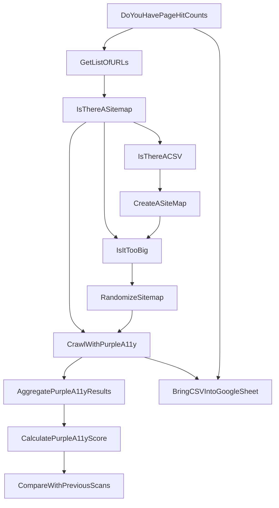

#Decision Tree for mult-page scans

```mermaid
graph TD;
    DoYouHavePageHitCounts-->GetListOfURLs;
    IsThereASitemap-->IsThereACSV;
    GetListOfURLs-->IsThereASitemap;
    IsThereACSV-->CreateASiteMap;
    IsThereASitemap-->CrawlWithPurpleA11y;
    IsThereASitemap-->IsItTooBig;
    CreateASiteMap-->IsItTooBig;
    IsItTooBig-->RandomizeSitemap;
    RandomizeSitemap-->CrawlWithPurpleA11y;
    CrawlWithPurpleA11y-->AggregatePurpleA11yResults;
    AggregatePurpleA11yResults-->CalculatePurpleA11yScore;
    CrawlWithPurpleA11y-->BringCSVIntoGoogleSheet;
    DoYouHavePageHitCounts-->BringCSVIntoGoogleSheet;
    CalculatePurpleA11yScore-->CompareWithPreviousScans;
```
